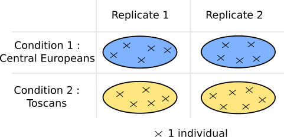

## Prerequisites

### Use case

*kissDE* is meant to work on pairs of variants that have been quantified across 
different conditions. It can deal with single nucleotide variations (SNPs, 
mutations, RNA editing), indels or alternative splicing.

As *kissDE* was first designed to be a brick of the *KisSplice* pipeline
[@KisSplice and [web page](https://kissplice.prabi.fr/)], 
the `kissplice2counts()` function can be directly applied to the output files 
from *KisSplice* or *KisSplice2refgenome*. 
Yet, *kissDE* can also run with any other software which produces count data 
as long as this data is properly formatted.

*kissDE* was designed to work with at least two 
replicates for each condition, which means that the minimal input contains the 
read counts of the variants for 4 different samples, each couple representing 
a biological condition and its 2 replicates. There can be more replicates and 
more conditions, but it is not mandatory to have an equal number of replicates 
in each condition.

### Install and load *kissDE* 

In a *R* session, the *BiocManager* package has first to be installed.

```{r}
#| label: installBC
#| eval: false
install.packages("BiocManager")
```

Then, the *kissDE* package can be installed from *Bioconductor* and finally 
loaded.

```{r}
#| label: install
#| eval: false
BiocManager::install("kissDE")
```

```{r}
#| label: library
library(kissDE)
```

### Quick start

Here we present the basic *R* commands for an analysis with *kissDE*. 
These commands require an external output file of *KisSplice*, for example
`output_kissplice.fa` (which is not included in this package). 
To deal with other types of input files, please refer to 
@sec-input.

The functions used in *kissDE* are `kissplice2counts()`, `qualityControl()`, 
`diffExpressedVariants()` and `writeOutputKissDE()`. 
For each function, default values of the parameters are used.
For more details on functions and their parameters see 
@sec-workflow.

Here we assume that there are two conditions (*condition_1* and 
*condition_2*) with two biological replicates and we also assume that the 
RNA-Seq libraries are single-end.

```{r}
#| label: quick_start
#| eval: false
counts <- kissplice2counts("output_kissplice.fa")
conditions <- c(rep("condition_1", 2), rep("condition_2", 2))
qualityControl(counts, conditions)
results <- diffExpressedVariants(counts, conditions)
writeOutputKissDE(results, output = "kissDE_output.tab")
```

Note that the functions `kissplice2counts()` and 
`diffExpressedVariants()` may take some time to run (see 
@sec-time for more details on running time).


## *kissDE*'s workflow {#sec-workflow}

In this section, the successive steps and functions of a differential analysis 
with *kissDE* are described.

{#fig-workflow}


### Input data {#sec-input}

*kissDE*'s input is a table of raw counts and a vector describing the number of 
conditions and replicates per condition. The table of raw counts can either 
be directly provided by the user or obtained with *KisSplice* or 
*KisSplice2refgenome* (see 
[https://kissplice.prabi.fr/training/](https://kissplice.prabi.fr/training/)).


#### Condition vector {#sec-condition}

The condition vector describes the order of the columns in the count table.

As an example, the counts are ordered as follow: the two first counts represent
the two replicates of *condition_1* and the two following counts the two
replicates of *condition_2*. In this case, the condition vector for these 2
conditions with 2 replicates per condition, would be:

```{r}
#| label: conditionVector_howto
myConditions <- c(rep("condition_1", 2), rep("condition_2", 2))
```

In the case where the input data contains more than 2 conditions, we advise 
the user to remove samples from the analysis in order to compare 2 conditions 
only, because *kissDE* was uniquely tested in this context. To remove samples 
from the analysis, the `*` character can be used:

```{r}
#| label: conditionVectorRemove_howto
myConditionsRm <- c(rep("condition_1", 2), 
                    rep("*", 2), 
                    rep("condition_3", 2))
```

Here, there are 3 conditions and 2 replicates per condition, but only
*condition_1* and *condition_3* will be considered in the analysis.

If the count table was loaded from *KisSplice* or *KisSplice2refgenome* output, 
the condition vector must contain the samples in the same order they were
given to *KisSplice* (see @sec-input_ks and @sec-input_krg).

::: {.callout-warning}
To run *kissDE*, all conditions must have replicates. So each condition 
must at least be present twice in the condition vector. If this is not the 
case, an error message will be printed.
:::


#### User's own data (without *KisSplice*): table of counts format {#sec-input_count}

Let's assume we work with two conditions (*condition_1* and *condition_2*) 
and two replicates per condition. An input example table contained in a
flat file called `table_counts_alt_splicing.txt` is loaded and stored in a 
`tableCounts` object.

```{r}
#| label: tablecounts_howto
# 'fpath1' contains the absolute path of the file on the user's hard disk
fpath1 <- system.file("extdata", "table_counts_alt_splicing.txt", 
    package = "kissDE")
tableCounts <- read.table(fpath1, head = TRUE)
```

In *kissDE*, the table of counts must be formatted as follows:

```{r}
#| label: tablecounts_head
head(tableCounts)
```

It must be a data frame with:

- **in rows:** 
  - One variation is represented by two lines, one for each variant. For 
  instance, for SNVs, one allele is described in the first line, and the other 
  in the second line. For alternative splicing events, the inclusion isoform and 
  the exclusion isoform have one line each.
  - The header must contain the column names in the flat file.

- **in columns:**
  - The first column (`eventsName`) contains the name of the variation.
  - The second column (`eventsLength`) contains the effective size of
  the variant in nucleotides (bp). The effective size corresponds to the number 
  of read mapping positions used when estimating the abundance of a variant.
  For the exclusion variant (2nd line), which should correspond to an exon-exon 
  junction, it corresponds to:
  $$ effectiveLengthExclu = readLength - 2 * overhang + 1 $$
  where $overhang$ corresponds to the minimal number of bases needed to accept
  that a read is aligned to a junction.
  For the inclusion variant (1st line), it corresponds to:
  $$ effectiveLengthInclu = effectiveLengthExclu + variablePartLength $$
  where $variablePartLength$ is the length of the region only present in the
  inclusion variant.
  In the special case where the abundance of the inclusion variant has been
  estimated using only junction reads, then the effective length of the
  inclusion variant is:
  $$ effectiveLengthInclu = 2 * effectiveLengthExclu $$
  This information is used only in the context of alternative splicing. In the
  context of SNVs, it can be set to 0. It is used to assess which splice
  variants may induce a frameshift (the difference of length between the 
  inclusion and exclusion variant is not a multiple of 3). 
  It is also used to precisely estimate the PSI (Percent Spliced In). 
  - All other columns (`cond1rep1`, `cond1rep2`, `cond2rep1`, `cond2rep2`) 
  contain read counts of a variant in a sample. In the example above, 
  `cond1rep1` is the number of reads supporting this variant in the first 
  replicate of *condition_1*,  `cond1rep2` is the number of reads
  supporting replicate 2 in *condition_1*, `cond2rep1` and `cond2rep2`
  are counts for replicates 1 and 2 of *condition_2*.


#### Input table from *KisSplice* output {#sec-input_ks}

*kissDE* was developped to deal with *KisSplice* output, which is in fasta format.
Below is the first four lines of an example of *KisSplice* output:

```{r}
#| label: kissplice_format
headfasta <- system.file("extdata", 
    "head_output_kissplice_alt_splicing_fasta.txt", package = "kissDE")
writeLines(readLines(headfasta))
```

Events are reported in blocks of 4 lines, the first two lines correspond to
one variant of the splicing event (or one allele of the SNV), the following
two lines correspond to the other variant (or the other allele). 
As for all fasta file, there is a header line beginning with the `>`
symbol and a line with the sequence. Each variant correspond to one entry in
the fasta file.

Headers contain information used in *kissDE*. In the example, there are:

- elements shared by the headers of the two variants:
  - `bcc_68965|Cycle_4` is the event's ID.
  - `Type_1` means that the sequences correspond to a splicing event. 
  `Type_0` corresponds to SNVs.
- elements that are specific to a variant:
  - `upper_path_length_112` and `lower_path_length_82` gives the
  length of the nucleotide sequences. Upper path and lower path are a 
  denomination for the representation of each variant in *KisSplice*'s graph.
  For alternative splicing events, the upper path represents the inclusion 
  isoform and the lower path the exclusion isoform.
  - `AS1_1|SB1_1|S1_0|ASSB1_0|AS2_0|SB2_0|S2_0|ASSB2_0|AS3_0|SB3_0|...`
  and `AB1_21|AB2_12|AB3_12|AB4_2|AB5_5|...` summarizes the counts 
  found by *KisSplice* quantification step. Here *KisSplice* was run
  with the option `counts` set to 2. 
  For the upper path, we have 4 counts for each sample: AS, SB, S 
  and ASSB. For the lower path, we have 1 count per sample: AB. The different 
  reads categories are shown on @fig-readstype . There are 8 sets
  of counts because we gave 8 files in input to *KisSplice* (denotated by the 
  number before the "\_" character). Each count (denotated by the number
  after the "\_" character) corresponds to the reads coming from each file
  that could be mapped on the variant, in the order they have been passed 
  to *KisSplice*.
- a rank information which is a deprecated measure.

![Different categories of reads. In this figure, 
we show an example of an alternative skipped exon. AS reads correspond to reads
spanning the junction between the excluded sequence and its left flanking exon,
SB to reads spanning the junction between the excluded sequence and its right 
flanking exon, ASSB to reads spanning the two inclusion junctions, S to reads 
entirely included in the alternative sequence and AB to reads spanning the 
junction between the two flanking exons. S reads correspond to exonic reads 
and all other categories of reads represented here correspond to junction reads.
](reads_type.png){#fig-readstype}


*kissDE* can be used on any type of events output by 
*KisSplice* (0: SNV; 1: alternative splicing events; 3: indels; ...). 
The user should refer to *KisSplice* manual 
([https://kissplice.prabi.fr/documentation/](https://kissplice.prabi.fr/documentation/)) 
for further questions about the *KisSplice* format and its output.

To be used in *kissDE*, *KisSplice* output must be converted into a table of
counts. 
This can be done with the `kissplice2counts()` function.
In the example below, the *KisSplice* output file called
`output_kissplice_alt_splicing.fa`, included in the *kissDE* package, is 
loaded.

The table of counts yielded by the `kissplice2counts()` function
is stored in `myCounts`.

```{r}
#| label: kissplice2counts_howto
# 'fpath2' contains the absolute path of the file on the user's hard disk.
fpath2 <- system.file("extdata", "output_kissplice_alt_splicing.fa", 
    package = "kissDE")
myCounts <- kissplice2counts(fpath2, pairedEnd = TRUE)
```

The counts returned by `kissplice2counts()` are extracted from the 
*KisSplice* header. By default, `kissplice2counts()` expects single-end reads 
and one count for each variant.

The `counts` parameter of `kissplice2counts()` must be 
the same as the `counts` parameter used to obtain data with *KisSplice*. 
The possible values are 0, 1 or 2. 0 is the default value for both 
`kissplice2counts()` and *KisSplice*.

The user can also specify the `pairedEnd` parameter in `kissplice2counts()`.
If RNA-Seq libraries are paired-end, `pairedEnd` should be set to `TRUE`. 
In this case, the `kissplice2counts()` function expects the counts
of the paired-end reads to be next to each other. 
If it is not the case, an additional `order` parameter should be used 
to indicate the actual order of the counts. For instance, if the experimental 
design is composed of two conditions with two paired-end replicates and if 
the input in *KisSplice* followed this order:

cond1_sample1_readpair1, cond1_sample2_readpair1, cond2_sample1_readpair1,
cond2_sample2_readpair1, cond1_sample1_readpair2, cond1_sample2_readpair2,
cond2_sample1_readpair2 and cond2_sample2_readpair2.

The order vector should be equal to `c(1,2,3,4,1,2,3,4)`.
An example of a paired-end dataset run with `counts` equal to 0 is
shown in @sec-SNV.

`kissplice2counts()` returns a list of four elements, including 
`countsEvents` which contains the table of counts required in *kissDE*.

```{r}
#| label: kissplice2counts_head
names(myCounts)
head(myCounts$countsEvents)
```

`myCounts$countsEvents` has the same structure as the 
`tableCounts` object in the @sec-input_count. 
It is a data frame with:

- **in rows**: One variation is represented by two lines, one for each variant. 
For instance for SNVs, one allele is described in the first line and the other
in the second line. For alternative splicing events (as in this example), the 
inclusion and the exclusion isoform have one line each.
- **in columns**:
  - The first column (`events.names`) contains the name of the variation, 
  using *KisSplice* notation.
  - The second column (`events.length`) contains the size of the variant in bp,
  extracted from the *KisSplice* header.
  - All others columns (`counts1`, `counts2`, `counts3`, `counts4`) 
  contain counts for each replicate in each condition for the variant.


#### Input table from *KisSplice2refgenome* output {#sec-input_krg}

The `kissplice2counts()` function can also deal with *KisSplice2refgenome* output 
data, in this case the `k2rg` parameter has to be set to `TRUE`.
*KisSplice2refgenome* allows the annotation of the alternative splicing events.
It assigns each event a gene and a type of alternative splicing event,
among which: Exon Skipping (ES), Intron Retention (IR), 
Alternative Donor (AltD), Alternative Acceptor (AltA). 
Interested users should refer to *KisSplice2refgenome* manual for further
questions about *KisSplice2refgenome* format and output ([https://kissplice.prabi.fr/tools/kiss2refgenome/](https://kissplice.prabi.fr/tools/kiss2refgenome/)).

In the example below, `output_k2rg_alt_splicing.txt`, a 
*KisSplice2refgenome*'s output included in the *kissDE* package, is loaded.
The `kissplice2counts()` function uses the same `counts` and 
`pairedEnd` parameters as explained in the @sec-input_ks.
The table of counts yielded by the `kissplice2counts()` function is
stored in `myCounts_k2rg`. 
It has exactly the same structure as detailed in @sec-input_ks.

```{r}
#| label: kissplice2counts_k2rg_howto
# 'fpath3' contains the absolute path of the file on the user's hard disk.
fpath3 <- system.file("extdata", "output_k2rg_alt_splicing.txt", 
    package = "kissDE")
myCounts_k2rg <- kissplice2counts(fpath3, pairedEnd = TRUE, k2rg = TRUE)
names(myCounts_k2rg)
head(myCounts_k2rg$countsEvents)
```

The *KisSplice2refgenome* output contains information about the type of 
splicing events. 
By default, all of the splicing events are analysed in *kissDE*, but
it is also possible to focus on subtypes of events. This events 
selection will speed up *kissDE*'s running time and improve statistical power 
for choosen events. To do this, the `kissplice2counts()` function 
contains two parameters: `keep` and `remove`. 
Both take a character vector indicating the types of events to keep or remove. 
The event names must be part of this list: `deletion`, `insertion`,
`IR`, `ES`, `altA`, `altD`, `altAD`, `indel`, `-`.
Thus, if the user is only interested in intron retention events, the
`keep` option should be set to `c("IR")`. If the user isn't
interessed in deletions and insertions, the `remove` option should be
equal to `c("insertion", "deletion")`.

The `keep` and `remove` parameters can be used at the same time 
only if `ES` is part of the `keep` vector. The `remove` 
vector will then act on the different types of exon skipping: multi-exon
skipping (`MULTI`) or exon skipping associated with an alternative 
acceptor site (`altA`), an alternative donor site (`altD`), 
both alternative acceptor and donor site (`altAD`) or any of the alt
combinaison with MULTI. Thus, in this specific case, the 
`remove` vector should contain names from this list: `MULTI`,
`altA`, `altD`, `altAD`, `MULTI_altA`, `MULTI_altD`, `MULTI_altAD`.

If the user wants to analyse only cassette exon events (i.e., a single exon is
skipped or included), the following command should be used:

```{r}
#| label: kissplice2counts_k2rg_ESonly_howto
myCounts_k2rg_ES <- kissplice2counts(fpath3, pairedEnd = TRUE, 
    k2rg = TRUE, keep = c("ES"), 
    remove = c("MULTI", "altA", "altD", "altAD", "MULTI_altA",
    "MULTI_altD", "MULTI_altAD"))
```


### Quality Control
*kissDE* contains a function that allows the user to control the quality of the 
data and to check if no error occured at the data loading step. 
This data quality assessment is essential and should be done before the 
differential analysis.

The `qualityControl()` function takes as input a count table (see
@sec-input_count, @sec-input_ks and @sec-input_krg) and a condition vector
(see @sec-condition): 

```{r}
#| label: qualityControl_howto
#| output: false
qualityControl(myCounts, myConditions)
```

It produces 2 graphs:

- a heatmap of the sample-to-sample distances using the 500 most variant 
events (see @fig-qualityControl1)
- the factor map formed by the first two axes of a principal component 
analysis (PCA) using the 500 most variant events (see @fig-qualityControl2)

::: {#fig-qualityControl layout-ncol=2}

{#fig-qualityControl1}

{#fig-qualityControl2}

Quality control plots
:::

These two graphs show the similarities and the differences between the 
analyzed samples.
Replicates of the same condition are expected to cluster together.
If this is not the case, the user should check if the order of the samples 
in the count table and in the condition vector is the same. 
If it is, this could mean that a sample is contaminated or has an abnormality 
that will influence the differential analysis.
The user can then go back to the quality control of the raw data to solve 
the problem or decide to remove the sample from the analysis.

In the heatmap plot, the samples that cluster together are from 
the same condition. 
In the PCA plot, the first principal component (PC1) summarize 90.2% of 
the total variance of the dataset. 
This first axis clearly separates the 2 conditions.

The created graphs can be saved by setting the `storeFigs` parameter 
of the `qualityControl()` function to `TRUE` (then graphs 
are stored in a `kissDEFigures` folder, created in a temporary directory, 
which is removed at the end of the user *R* session) or to the path where the 
user wants to store his/her graphs. We recommend to use this parameter when the
`qualityControl()` function is used in an automatized workflow.

To customize the PCA plot, the data frame used for this plot can be extracted
by setting the option `returnPCAdata` to `TRUE` as follows:

```{r}
#| label: returnPCAdata_howto
#| output: false
PCAdata <- qualityControl(myCounts, myConditions, returnPCAdata = TRUE)
```


### Differential analysis {#sec-diffanalysis}

When data are loaded, the differential analysis can be run using the 
`diffExpressedVariants()` function. 
This function has two mandatory parameters: a count table (`countsData` 
parameter, see @sec-input_count, @sec-input_ks and @sec-input_krg) 
and a condition vector (`conditions` parameter, see @sec-condition).

In the example below, the differential analysis results are stored in the 
`myResults` object:

```{r}
#| label: diffExpressedVariants_howto
myResults <- diffExpressedVariants(countsData = myCounts,
    conditions = myConditions)
```

The `diffExpressedVariants()` function has three parameters to change
the filters or the flags applied on the data, one parameter 
to indicate if the replicates are technical or biological, and one parameter
to indicate how many cores should be used :

- `pvalue`: By default, the p-value threshold to output the significant events is set to 1. So all variants are output in the final table. This parameter must be a numeric value between 0 and 1. Be aware that by setting `pvalue` to 0.05, only events that have been identified as significant between the conditions with a false discovery rate (FDR) $\leqslant$ 5% will be present in the final table. A posteriori changing this threshold will require to re-run the differential analysis.

- `filterLowCountsVariants`: This parameter allows to change the threshold to filter low expressed events before testing (as explained in @sec-filter). By default, it is set to 10.

- `flagLowCountsConditions`: This parameter allows to change the threshold to flag low expressed events (as explained in @sec-flag). By default, it is set to 10.

- `technicalReplicates`: Boolean value indicating if the user is working with technical replicates only (we do not advise users to mix biological and technical replicates in their analyses). If this parameter is set to `TRUE`, the counts will be modeled with a Poisson distribution. If it is equal to `FALSE`, the counts will be modeled with a Negative Binomial distribution. For more information, see @sec-dispersion. By default, this option is set to `FALSE`.

- `nbCore`: An integer value indicating how many cores should be used for the computation. This parameter should be strictly lower than the number of core of the computer (`nbCore` $<$ nbr computer cores $- 1$). By default, this parameter is set to 1, meaning that the computation are not parallelized.

The `diffExpressedVariants()` function returns a list of 6 objects:

```{r}
#| label: myResults_description
names(myResults)
```

The `uncorrectedPVal` and `correctedPval` outputs are numeric
vectors with p-values before and after correction for multiple testing.
`resultFitNBglmModel` is a data frame containing the results of the 
fitting of the model to the data.
`k2rgFile` is a string containing either the *KisSplice2refgenome* file path and name or 
NULL if no *KisSplice2refgenome* file was used as input.
For explanations about the `finalTable` and `f/psiTable` outputs, 
see @sec-finaltable and @sec-psitable, respectively.

To visualize the distribution of the p-values before the application of the
Benjamini-Hochberg [@benjamini1995] multiple testing correction procedure,
the histogram of the p-values before correction can be plotted by using the 
following command:

```{r}
#| label: hist_pvalue_before_correction
#| output: false
hist(myResults$uncorrectedPVal, main = "Histogram of p-values", 
    xlab = "p-values", breaks = 50)
```

Because the dataset used here is small ($\sim$ 100 lines), the histograms of 
the two complete datasets presented in the case studies (
@sec-casestudies) are represented. As expected, the histograms show a 
uniform distribution with a peak near 0 (@fig-distribpvalue).

{#fig-distribpvalue}


### Output results

#### Final table {#sec-finaltable}

The `finalTable` object is the main output of the 
`diffExpressedVariants()` function.

The first 3 rows of the `myResults$finalTable` output are as follows:

```{r}
#| label: finaltable_description
print(str(myResults))
```

The columns of this table contain the following information:

- `ID` is the event identifier. Each event is represented by one 
row in the table.
- `Length_diff` contains the variable part length in a splicing 
event. It is the length difference between the upper and lower path. 
This column is not relevant for SNVs. 
- `Variant1_condition_1_repl1_Norm` and following columns 
contain the counts for each replicate of each variant after normalization 
(raw counts are normalized as in the *DESeq2* *Bioconductor* *R* 
package, see details in @sec-norm). The first half of these 
columns concerns the first variant of each event, the second half the second 
variant.
- `Adjusted_pvalue` contains p-values adjusted by a 
Benjamini-Hochberg procedure.
- `Deltaf/DeltaPSI` summarizes the magnitude of the effect 
(see details in @sec-psi).
- `lowcounts` contains booleans which flag low counts events 
as described in @sec-flag. A `TRUE` value means 
that the event has low counts (counts below the chosen threshold).

In the `finalTable` output, events are sorted by p-values and then by 
magnitude of effect (based on their absolute values), so that the top 
candidates for further investigation/validation appear at the beginning 
of the output.


::: {.callout-warning}
When the p-value computed by *kissDE* is lower than the smallest number
greater than zero that can be stored (i.e., 2.2e-16), this p-value is set to 0.
:::

To save results, a tab-delimited file can be written with 
`writeOutputKissDE()` function where an `output` parameter 
(containing the name of the saved file) is required. 
Here, the `myResults` output is saved in a file called 
`results_table.tab`:

```{r}
#| label: finaltable_write
#| eval: false
writeOutputKissDE(myResults, output = "kissDE_results_table.tab")
```

Users can choose to export only events passing some thresholds on adjusted 
p-value and/or Deltaf/DeltaPSI using the options `adjPvalMax` and 
`dPSImin` of the `writeOutputKissDE()` function. 
For example, if we want to save in a file called 
`results_table_filtered.tab` only events with the adjusted p-value 
$\leqslant$ 0.05 and the Deltaf/DeltaPSI absolute value $\geqslant$ 0.10, 
the following command can be used:

```{r}
#| label: finaltable_thresholds_write
#| eval: false
writeOutputKissDE(myResults, output = "kissDE_results_table_filtered.tab", 
    adjPvalMax = 0.05, dPSImin = 0.10)
```


If the counts table was built from a *KisSplice2refgenome* output with the 
`kissplice2counts()` function, running the
`writeOutputKissDE()` will write a file merging results of differential 
analysis with *KisSplice2refgenome* data. 
As previously explained (@sec-finaltable), users can choose 
to save only events passing thresholds:

```{r}
#| label: krg_output_write
#| eval: false
writeOutputKissDE(myResults_K2RG, output = "kissDE_K2RG_results_table.tab", 
    adjPvalMax = 0.05, dPSImin = 0.10)
```


#### f/PSI table {#sec-psitable}

The `f/psiTable` output of the `diffExpressedVariants()` 
function contains the f values for SNV analysis or PSI values for alternative 
splicing analysis (see details and computation in @sec-psi) 
for each event in each sample.

The first three rows of the `f/psiTable` output of the 
`myResults` object (created in the @sec-diffanalysis) 
look like this:

```{r}
#| label: fPSItable_description
head(myResults$`f/psiTable`, n = 3)
```

This output can be useful to carry out downstream analysis or to produce 
specific plots (like heatmap on f/PSI events). 
To use this information with external tools, this table can be saved in a 
tab-delimited file (here called `result_PSI.tab`), setting the 
`writePSI` parameter to `TRUE` in the 
`writeOutputKissDE()` function:

```{r}
#| label: fPSItable_write
#| eval: false
writeOutputKissDE(myResults, output = "result_PSI.tab", writePSI = TRUE)
```


## *kissDE*'s theory

In this section, the different steps of the *kissDE* main function,
`diffExpressedVariants()`, are detailed. 
They are summarized in the @fig-kdetheory.

{#fig-kdetheory}


### Normalization {#sec-norm}

In a first step, counts are normalized with the default normalization
methods provided by the *DESeq2* (@DESeq2) package.
The size factors are estimated using the sum of counts of both
variants for each event, which is a proxy of the gene expression.
By using this normalization, we correct for library size, 
because the sequencing depth can vary between samples.


### Estimation of dispersion {#sec-dispersion}

A model to describe the counts distribution is first chosen.
When working with technical replicates (`technicalReplicates = TRUE` 
in `diffExpressedVariants()`), the Poisson model 
(model $\mathcal{M}(\phi=0)$) is chosen in *kissDE*.

When working with biological replicates (`technicalReplicates = FALSE` 
in `diffExpressedVariants()`), the Poisson distribution's
variance parameter is in general not flexible enough to describe the data,
because replicates add several sources of variance.

This overdispersion is often modeled using a Negative Binomial distribution. 
In *kissDE*, the overdispersion parameter, $\phi$, is estimated using the 
*DSS* *R* package [@DSS1; @DSS2; @DSS3; @DSS4] 
(model $\mathcal{M}(\phi=\phi^i_{\text{DSS}})$.

The *DSS* package (and, to our knowledge, every other package
estimating the overdispersion of the Negative Binomial model) is suited 
for differential expression analysis (one count per sample). 
In differential splicing and SNV analysis, two counts (one for each 
splice variant or allele) are associated with each sample. In order to
mimic gene expression, the overdispersion parameter $\phi$ is estimated
on the sum of the splice variant or allele counts of each sample.


### Pre-test filtering {#sec-filter}

If global counts for both variants are too low (option 
`filterLowCountsVariants`), the event is not tested.
The rationale behind this filter is to speed up the analysis and gain 
statistical power.

Here we present an example to explain how `filterLowCountsVariants` 
option works. Let's assume that there are two conditions and two replicates
per condition. `filterLowCountsVariants` keeps its default value, 10.

+--------------+---------------------------+---------------------------+------------------+
|              | Condition 1               | Condition 2               | Sum by variant   |
|              +-------------+-------------+-------------+-------------+                  |
|              | replicate 1 | replicate 2 | replicate 1 | replicate 2 |                  |
+==============+=============+=============+=============+=============+==================+
| Variant 1    | 2           | 1           | 3           | 2           | 2+1+3+2=8 $<$ 10 |
+--------------+-------------+-------------+-------------+-------------+------------------+
| Variant 2    | 8           | 0           | 1           | 0           | 8+0+1+0=9 $<$ 10 |
+--------------+-------------+-------------+-------------+-------------+------------------+

: Example of an event filtered out before the differential analysis, because
less than 10 reads support each variant. {#tbl-filter1}

In this example (@tbl-filter1), the two variants have 
global counts less than 10, this event will be used to compute the
overdispersion, but will not be used to compute the models. 
It will neither appear in the result table.


### Model fitting

Then we design two models to take into account interactions with variants
(SNVs or alternative isoforms) and experimental conditions as main effects.
We  use the generalised linear model framework. The expected intensity 
$\lambda_{ijk}$ can be written as follows:

$$ \mathcal{M_0}:\:\:\log \lambda_{ijk} = \mu + \alpha_{i} +\beta_{j}$$

$$ \mathcal{M_1}:\:\:\log \lambda_{ijk} = \mu + \alpha_{i} + \beta_{j} + \left(\alpha \beta \right)_{ij} $$

where $\mu$ is the local mean expression of the transcript that contains the 
variant, $\alpha_{i}$ the effect of variant $i$ on the expression, $\beta_{j}$ 
the contribution of condition $j$ to the total expression, and 
$\left(\alpha \beta \right)_{ij}$ the interaction term. 

To avoid singular hessian matrices while fitting models, pseudo-counts
(i.e., systematic random allocation of ones) were considered for variants
showing many zero counts.


### Likelihood ratio test

To select between $\mathcal{M_0}$ and $\mathcal{M_1}$, we perform a Likelihood 
Ratio Test (LRT) with one degree of freedom. 
In the null hypothesis $H_0:\{\left(\alpha \beta \right)_{ij}=0\}$, there is no 
interaction between variant and condition. 
For events where $H_0$ is rejected, the interaction term is significant to 
explain the count's distribution, which leads to conclude to a differential 
usage of a variant across conditions. 
p-values are then adjusted with a 5% false discovery rate (FDR) following 
a Benjamini-Hochberg procedure [@benjamini1995] to account for multiple
testing.


### Flagging low counts {#sec-flag}

If in at least $n-1$ conditions (be $n$ the number of conditions $\geq 2$) an 
event has low counts (option `flagLowCountsConditions`), it is flagged (`TRUE`
in the last column of the `finalTable` output).

In the example @tbl-flag1, we can see that the counts are quite 
contrasted, variant 1 seemed more expressed in condition 2 and variant 2 
in condition 1. 
Moreover, this event has enough counts for each variant not to be filtered
out when the `filterLowCountsVariants` parameter is set to 10:

+------------------+---------------------------+---------------------------+----------------------+
|                  | Condition 1               | Condition 2               | Sum by variant       |
|                  +-------------+-------------+-------------+-------------+                      |
|                  | replicate 1 | replicate 2 | replicate 1 | replicate 2 |                      |
+==================+=============+=============+=============+=============+======================+
| Variant 1        | 1           | 0           | 60          | 70          | 1+0+60+70=131 $>$ 10 |
+------------------+-------------+-------------+-------------+-------------+----------------------+
| Variant 2        | 5           | 3           | 10          | 20          | 5+3+10+20=38 $>$ 10  |
+==================+=============+=============+=============+=============+======================+
| Sum by condition | **9** < 10                | 160 > 10                  |                      |
+------------------+-------------+-------------+-------------+-------------+----------------------+

: Example of an event flagged as having low counts, because less than 10
reads support this event in the first condition. {#tbl-flag1}

However, in $n-1$ (here 1) condition, the global count for
one condition is less than 10 (9 for condition 1), so 
`flagLowCountsConditions` option will flag this event as 
`'Low_Counts'`. This event may be interesting because it has 
the potential to be found as differential. However, it will be hard to
validate it experimentally, because the gene is poorly expressed in condition 1.


### Magnitude of the effect {#sec-psi}

When a gene is found to be differentially spliced between two conditions, or 
an allele is found to be differentially present in two 
populations/conditions, one concern which remains is to quantify the 
magnitude of this effect.
Indeed, especially in RNA-Seq, where some genes are very highly expressed 
(and hence have very high read counts), it is often the case that we detect 
significant (p-value $\leqslant$ 0.05) but weak effects. 

When dealing with genomic variants, we quantify the magnitude of the effect 
using the difference of allele frequencies (f) between the two conditions.
When dealing with splicing variants, we quantify the magnitude of the effect 
using the difference of Percent Spliced In (PSI) between the two conditions.
These two measures turn out to be equivalent and can be summarized using the 
following formula:

$$ PSI \:=\: f  \:=\:  \frac{\#counts*\_variant_1}{\#counts*\_variant_1 + \#counts\_variant_2} $$
$$ \Delta PSI \:=\: PSI_{cond1} - PSI_{cond2} $$
$$ \Delta f \:=\: f_{cond1} - f_{cond2} $$

In this formula, $\#counts*\_variant_1$ correspond to the normalized number 
of reads of the $variant_1$, itself normalized for the variant length.
Indeed, by construction, $variant_1$ always have a length greater than or equal
to the $variant_2$. That's why we divide the normalized number of reads of the 
$variant_1$ by the ratio of the length of the $variant_1$ and the $variant_2$.

The $\Delta$PSI/$\Delta$f is computed as follows:

- First, individual (per replicate) PSI/f are calculated. If counts for both 
upper and lower paths are too low ($<10$) after normalization, the individual
PSI/f are not computed.
- Then mean PSI/f are computed for each condition. If more than half of the 
individual PSI/f were not calculated at the previous step, the mean PSI/f is
not computed either.
- Finally, we output $\Delta$PSI/$\Delta$f. Unless one of the mean PSI/f of 
a condition could not be computed, $\Delta$PSI/$\Delta$f is calculated 
subtracting one condition PSI/f from another. $\Delta$PSI/$\Delta$f absolute
value vary between 0 and 1, with values close to 0 indicating low effects and 
values close to 1 strong effects. Note that the conditions are ordered 
alphabetically, and that *kissDE* substract the condition coming first in the 
alphabet to the other.


## Case studies {#sec-casestudies}

To detect SNVs (SNPs, mutations, RNA editing) or alternative splicing (AS) 
in the expressed regions of the genome, *KisSplice* can be run on RNA-seq data.
Counts can then be analysed using *kissDE*. 
We present two distinct case studies with *kissDE*: analysis of AS events and 
analysis of SNVs.

### Application of *kissDE* to alternative splicing {#sec-AS}

This first example corresponds to the case of differential analysis of 
alternative splicing (AS) events. 
The sample data presented here is a subset of the case study used in 
@Benoit-Pilven (see 
[https://kissplice.prabi.fr/pipeline_ks_farline/](https://kissplice.prabi.fr/pipeline_ks_farline/)).


#### Dataset

The data used in this example comes from the ENCODE project [@Djebali2012]. 
The samples are from a neuroblastoma cell line, SK-N-SH, with or without a 
retinoic acid treatment. 
Each condition is composed of two biological replicates. 
The data are paired-end.

In a preliminary step, *KisSplice* has been run to analyse these two conditions. 
Results from *KisSplice* (type 1 events) were then mapped to the reference 
genome with *STAR* [@Dobin2013] and analyzed with *KisSplice2refgenome*. 
*KisSplice2refgenome* enables to annotate the AS events discovered 
by *KisSplice*. 
It assigns to each event a gene and a type of alternative splicing 
(Exon Skipping (ES), Intron Retention (IR), Alternative Donor (AltD), 
Alternative Acceptor (AltA), \dots).

For further information on these tools (*KisSplice* and *KisSplice2refgenome*),
please refer to the manual that can be found on this web page: 
[https://kissplice.prabi.fr/](https://kissplice.prabi.fr/).

The output file of *KisSplice2refgenome* is a tab-delimited file that stores 
the annotated alternative splicing events found in the dataset. 
Below is an extract of this file (the first 3 rows and first 10 columns),
where each row is one alternative splicing event of our data:

```{r}
#| label: AS_data
fileInAS <- system.file("extdata", "output_k2rg_alt_splicing.txt",
    package = "kissDE")
exampleK2RG <- read.table(fileInAS)
names(exampleK2RG) <- c("Gene_Id", "Gene_name",
    "Chromosome_and_genomic_position", "Strand", "Event_type",
    "Variable_part_length", "Frameshift_?", "CDS_?", "Gene_biotype",
    "number_of_known_splice_sites/number_of_SNPs")
print(head(exampleK2RG[, c(1:10)], 3), row.names = FALSE)
```


#### Load data

The `kissplice2counts()` function allows to load directly the
*KisSplice2refgenome* output file (here called `output_k2rg_alt_splicing.txt`)
into a format compatible with *kissDE*'s main functions.

The `k2rg` parameter is set to `TRUE` to indicate that the file comes from 
*KisSplice2refgenome* and not directly from *KisSplice*.
As these samples are paired-end, the `pairedEnd` parameter is set to `TRUE`.
The `counts` parameter must be set to the same value (i.e., 2) used in
*KisSplice* and *KisSplice2refgenome* to indicate which type of counts are
given in the input.
Here the exonic reads are not taken into account (`exonicReads = FALSE`).
Only junction reads will be used (see @fig-readstype).

The table of counts is stored in a `myCounts_AS` object (for a
detailed description of its structure, see @sec-input_krg):

```{r}
#| label: AS_counts
# 'fileInAS' contains the absolute path of the file on the user's hard disk.
fileInAS <- system.file("extdata", "output_k2rg_alt_splicing.txt",
    package = "kissDE")
myCounts_AS <- kissplice2counts(fileInAS, pairedEnd = TRUE, k2rg = TRUE, 
    counts = 2, exonicReads = FALSE)
head(myCounts_AS$countsEvents)
```

To perform the differential analysis, a vector that describes the experimental
plan is needed. 
In this case study, there are two replicates of the SK-N-SH cell line without 
treatment (SKNSH) followed by two replicates of the same cell line treated 
with retinoic acid (SKSNH-RA). 
So the `myConditions_AS` vector is defined as follows:

```{r}
#| label: AS_condition
myConditions_AS <- c(rep("SKNSH",2), rep("SKNSH-RA",2))
```


#### Quality control

Before running the differential analysis, we check that the data was loaded 
correctly, using the `qualityControl()` function.

```{r}
#| label: qualityControl_AS
#| output: false
qualityControl(myCounts_AS, myConditions_AS)
```

::: {#fig-qcAS layout-ncol=2}

{#fig-qcAS1}

{#fig-qcAS2}

Quality control plots on alternative data
:::

On both plots returned by the `qualityControl()` function (@fig-qcAS), 
the replicates of the same condition seem to be more similar
between themselves than to the samples of the other condition. 
On the heatmap (@fig-qcAS1), the samples of the same
condition cluster together. 
On the PCA plot (@fig-qcAS2), the first principal component (which
summarises 88% of the total variance) clearly discriminates the two conditions.


#### Differential analysis

The main function of *kissDE*, `diffExpressedVariants()`, can now be run to 
compute the differential analysis. 
Outputs are stored in a `myResult_AS` object (for a detailed description of 
its structure, see @sec-finaltable) and the 
result for the first three events is given below:

```{r}
#| label: AS_test
myResult_AS <- diffExpressedVariants(myCounts_AS, myConditions_AS)
# head(myResult_AS$finalTable, n = 3)
str(myResult_AS)
```

The first event in the `myResult_AS` output has a very low p-value 
(`Adjusted_pvalue` column, less than `2.2e-16`) and a very contrasted 
$\Delta PSI$ (`Deltaf/DeltaPSI` column, equal to `-0.804`) close to the 
maximum value (1 in absolute). 
This gene is differentially spliced. 
When the SK-N-SH cell line is treated with retinoic acid, the inclusion
variant becomes the major isoform. 


#### Export results

In order to facilitate the downstream analysis of the results, two tables 
are exported: the result table (`myResults_AS$finalTable` object, see 
@sec-finaltable) is saved in a `results_table.tab` file and the PSI table 
(`myResults_AS$'f/psiTable'`, see 
@sec-psitable) is saved in a `psi_table.tab` file. 
Here are the commands to carry out this task:

```{r}
#| label: AS_export
#| eval: false
writeOutputKissDE(myResults_AS, output = "results_table.tab")
writeOutputKissDE(myResults_AS, output = "psi_table.tab", writePSI = TRUE)
```

#### Explore results

The `writeOutputKissDE()` function also write an `rds` file in the output 
directory, with a `.rds` extension. This file can be inputed in the 
`exploreResults` function in order to explore and plot the results of
*kissDE* through a Shiny interface:

```{r}
#| label: as_explore_result
#| eval: false
exploreResults(rdsFile = "results_table.tab.rds")
```

#### One command to rule them all

All of *kissDE* R command line can be run at once with the `kissDE` function.

```{r}
#| label: as_kissDE_result
#| eval: false
fileInAS <- system.file("extdata", "output_k2rg_alt_splicing.txt",
    package = "kissDE")
myConditions_AS <- c(rep("SKNSH", 2), rep("SKNSH-RA", 2))
kissDE(fileName = fileInAS, conditions = myConditions_AS, 
       output = "results_table.tab", counts = 2, pairedEnd = TRUE, k2rg = TRUE,
       exonicReads = FALSE, writePSI = TRUE, doQualityControl = TRUE,
       resultsInShiny = TRUE)
```


### Application of *kissDE* to SNPs/SNVs {#sec-SNV}

This second example present an analysis of SNPs/SNVs done with *kissDE*
on RNA-Seq data from a subset of the case study presented in @Lopez-Maestre2016
([https://kissplice.prabi.fr/TWAS/](https://kissplice.prabi.fr/TWAS/)).

The original purpose of this study was to demonstrate that the method can deal 
with pooled data (i.e., individuals are pooled prior to sequencing). 
Pooling can be used to decrease the costs. 
It is also sometimes the only option, when too few RNA is available per
individual.
The method can in principle be used on unpooled data, polyploid genomes,
and for the detection of somatic mutations, but has for now only been
evaluated for the detection of SNPs/SNVs in pooled RNAseq data.

In the remaining, we use the term SNV, which designates a variation of a
single nucleotide, without any restriction on the frequency of the two alleles. 
The term SNP is indeed classically used for variants present in at least 
1% of a population.


#### Dataset

The dataset comes from the human GEUVADIS project. 
Two populations were selected: Toscans (TSC) and Central Europeans (CEU). 
For each population, we selected 10 individuals, which are pooled in 
two groups of 5. 
Each group corresponds to a replicate for *kissDE*. 
The conditions being compared are the populations.

{#fig-designSNP}

The data are paired-end. So each sample consists of 2 files. 
In total, 8 files have been used: 4 files for the two TSC samples and 
4 files for the two CEU samples. 
Paired-end files from a same sample have been given as following each 
other to *KisSplice*.

*KisSplice* outputs a fasta file that stores SNVs found in the dataset. 
Its structure is described in @sec-input_ks. 
The first SNV is presented below:

```{r}
#| label: snv_kissplice_data
headfasta <- system.file("extdata", "head_output_kissplice_SNV_fasta.txt", 
    package = "kissDE")
writeLines(readLines(headfasta))
```

Events are reported in 4 lines, the two first represent one allele of the SNV,
the two last the other allele. 
Thus the sequences only differ from each other at one position which 
corresponds to the SNV, here A/C in the center of the sequence (at position 42).

Because *KisSplice* was run with the default value of the `counts` parameter 
(i.e., 0), the counts have the following format `C1_x|C2_y|...|Cn_z`. 
In this example, there are 8 counts because we input 8 files. 
Each count corresponds to the reads coming from each file that could be
mapped on the variant, in the order they have been passed to *KisSplice*. 
This information is particularly important in *kissDE* since it represents
the counts used for the test.


#### Load data

The first step is to convert this fasta file (here called 
`output_kissplice_SNV.fa`) into a format that will be used in *kissDE* 
main functions, thanks to the `kissplice2counts()` function.

Due to paired-end RNA-Seq data, the `pairedEnd` parameter was set to `TRUE`.

This conversion in a table of counts is stored in the `myCounts_SNV`
object (for a detailed description of its structure, see 
@sec-input_ks) and can be done as follows:

```{r}
#| label: snv_counts
# 'fileInSNV' contains the absolute path of the file on the user's hard disk.
fileInSNV <- system.file("extdata", "output_kissplice_SNV.fa", 
    package = "kissDE")
myCounts_SNV <- kissplice2counts(fileInSNV, counts = 0, pairedEnd = TRUE)
head(myCounts_SNV$countsEvents)
```

To perform the differential analysis, a vector with the conditions 
has to be provided.
In the example, there are two replicates of TSC and two replicates of CEU, 
thus the condition vector `myConditions_SNV` is:

```{r}
#| label: snv_condition
myConditions_SNV <- c(rep("TSC",2), rep("CEU",2))
```


#### Quality control

Before running the differential analysis, we recommand to check if the data 
was correctly loaded, by running the `qualityControl()` function.

```{r}
#| label: qualityControl_SNV
#| output: false
qualityControl(myCounts_SNV, myConditions_SNV)
```

::: {#fig-qcSNV layout-ncol=2}

{#fig-qcSNV1}

{#fig-qcSNV2}

Quality control plots on SNV data
:::

On both plots outputed (@fig-qcSNV), the replicates of the same 
condition seem to be more similar between themselves than to the samples of 
the other condition. 
On the heatmap (@fig-qcSNV1), the samples of the same 
condition cluster together. 
On the PCA plot (@fig-qcSNV2), the first principal 
component (which summarises 88% of the total variance) clearly discriminates 
the two conditions.


#### Differential analysis

The main function of *kissDE*, `diffExpressedVariants()`, can now be run 
to compute the statistical test.

Outputs are stored in a `myResult_SNV` object (for a detailed
description of its structure, see @sec-finaltable) and the
result for the first three events is printed:

```{r}
#| label: snv_test
myResult_SNV <- diffExpressedVariants(myCounts_SNV, myConditions_SNV)
str(myResult_SNV)
```

The first event in the `myResult_SNV` output has a low p-value 
(`Adjusted_pvalue` column, equal to `8.63e-13`) and a very high absolute 
value of $\Delta f$ (`Deltaf/DeltaPSI` column, equal to `-0.926`) close to 
the maximum value (1 in absolute). 
This SNP would typically be population specific. 
One allele is enriched in the Toscan population, the other in the European 
population.


#### Export results

We consider as significant the events that have an adjusted p-value lower 
than 5%, so we set `adjPvalMax = 0.05`. Results passing this threshold are 
saved in a `final_table_significants.tab` file, with the 
`writeOutputKissDE()` function, as follows:

```{r}
#| label: snv_export_result
#| eval: false
writeOutputKissDE(myResults_SNV, output = "final_table_significants.tab", 
    adjPvalMax = 0.05)
```

#### Explore results

The `writeOutputKissDE()` function also write an `rds` file in the output
directory, with a `.rds` extension. This file can be inputed in the
`exploreResults` function in order to explore and plot the results 
of *kissDE* through a Shiny interface:

```{r}
#| label: snv_explore_result
#| eval: false
exploreResults(rdsFile = "final_table_significants.tab.rds")
```

#### One command to rule them all

All of *kissDE* *R* command line can be run at once with the `kissDE` function.

```{r}
#| label: snv_kissDE_result
#| eval: false
fileInSNV <- system.file("extdata", "output_kissplice_SNV.fa", 
    package = "kissDE")
myConditions_SNV <- c(rep("TSC", 2), rep("CEU", 2))
kissDE(fileName = fileInSNV, conditions = myConditions_SNV, 
       output = "results_table.tab", counts = 2, pairedEnd = TRUE, k2rg = TRUE,
       exonicReads = FALSE, writePSI = TRUE, doQualityControl = TRUE,
       resultsInShiny = TRUE)
```

### Time / Requirements {#sec-time}

The statistical analysis function (`diffExpressedVariants()`) is the 
most time-consuming steps. Here is an example of the running time of this 
function on the two complete datasets presented in the case studies 
(@sec-casestudies). The time presented were evaluated on a desktop computer
with the following characteristics: Intel Core i7, CPU 2,60 GHz, 16G RAM.

+----------+--------------------+------------------+-------------------------------------------+
| Dataset  | Options            | Number of events | Running time of `diffExpressedVariants()` |
+==========+====================+==================+===========================================+
| AS data  | `counts = 2`       | 59132            | 17m                                       |
|          | `pairedEnd = TRUE` |                  |                                           |
|          | `k2rg = TRUE`      |                  |                                           | 
+----------+--------------------+------------------+-------------------------------------------+
| SVN data | `counts = 0`       | 64824            | 18m                                       |
|          | `pairedEnd = TRUE` |                  |                                           |
+----------+--------------------+------------------+-------------------------------------------+

: Profiling. Running time of the principal function of *kissDE*
(`diffExpressedVariants()`) for two datasets (AS dataset from the 
ENCODE project [@Djebali2012] described in @sec-AS and SNV dataset from the 
GEUVADIS project [@Lappalainen2013] described in @sec-SNV). {#tbl-time}

To reduce even more the running time of `diffExpressedVariants()`,
the parameter `nbCore` can be used to parallelize the most time-consuming step
of this function (for more detailed explanation on this parameter see 
@sec-diffanalysis).


## Session info

```{r}
#| label: sessioninfo
sessionInfo()
```

